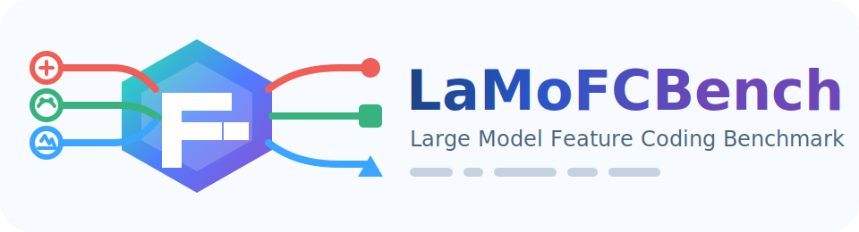

  
   
  
  

LaMoFCBench is a benchmark and evaluation toolkit for universal large model feature coding across multiple modalities.

## Project Overview

This repository currently covers four task groups:
- Common Vision Understanding (CVU), model family: DINOv3-ViT7B
- Common Language Understanding (CLU), model families: Qwen3-8B, FalconMamba-7B
- Common Audio Understanding (CAU), model family: KimiAudio-7B
- Controllable Text-to-Image (CTTI), model family: StableDiffusion3.5 + ControlNet

Core directories:
- `coding/`: feature coding pipeline (`feature_coding.py`) and batch launcher (`feature_coding.sh`)
- `machine/`: downstream task evaluation scripts
- `lmfc_utils/handlers/`: feature parsers/packers/unpackers
- `lmfc_utils/custom_codecs/`: learned codec wrappers for the implementation in [CompressAI](https://github.com/interdigitalinc/compressai) used by feature coding
- `lmfc_utils/transform_mapping/`: quantization mapping files

## Data Resources

All hosted resources are under: <https://www.modelscope.cn/collections/yooweey/LaMoFCBench>

Main datasets:
- Raw datasets: <https://www.modelscope.cn/datasets/yooweey/FeatureCoding-RawDatasets>
- Raw extracted features:
  - DINOv3: <https://www.modelscope.cn/datasets/yooweey/FeatureCoding-DINOv3>
  - Qwen3/FalconMamba: <https://www.modelscope.cn/datasets/yooweey/FeatureCoding-LargeLanguageModel>
  - KimiAudio: <https://www.modelscope.cn/datasets/yooweey/FeatureCoding-KimiAudio>
  - SD3.5 + ControlNet: <https://www.modelscope.cn/datasets/yooweey/FeatureCoding-StableDiffusion3.5Large>
- Post-coding features:
  - DINOv3:
    - <https://www.modelscope.cn/datasets/yooweey/FeatureCoding-DINOv3TotalCls-AfterCodec>
    - <https://www.modelscope.cn/datasets/yooweey/FeatureCoding-DINOv3TotalSegHyperprior-AfterCodec>
    - <https://www.modelscope.cn/datasets/yooweey/FeatureCoding-DINOv3TotalSegELIC-AfterCodec>
    - <https://www.modelscope.cn/datasets/yooweey/FeatureCoding-DINOv3TotalDepHyperprior-AfterCodec>
    - <https://www.modelscope.cn/datasets/yooweey/FeatureCoding-DINOv3TotalDepELIC-AfterCodec>
  - Qwen3: <https://www.modelscope.cn/datasets/yooweey/FeatureCoding-Qwen3LLM-AfterCodec>
  - FalconMamba: <https://www.modelscope.cn/datasets/yooweey/FeatureCoding-FalconMambaLLM-AfterCodec>
  - KimiAudio: <https://www.modelscope.cn/datasets/yooweey/FeatureCoding-KimiAudio-AfterCodec>
  - SD3.5 + ControlNet: <https://www.modelscope.cn/datasets/yooweey/FeatureCoding-StableDiffusion3.5ControlNet-AfterCodec>

## Quick Start

### Environment

Recommended baseline:
- Python 3.10+
- PyTorch + CUDA (for GPU runs)
- `compressai`, `einops`, `zstandard`, `tabulate`
- task-specific dependencies used by scripts under `machine/`

### Feature Coding

In the folder `coding`:
1. download the pre-trained codec weights by the shell script `download_codec_weights.sh`;
2. download the pre-extracted large model features from aforementioned links;
3. modify the path information of these features in the `feature_coding.sh`;
4. use the script `feature_coding.sh` to coding the pre-extracted large model features.

Notes for `feature_coding.sh`:
- valid `--handler` values come from `lmfc_utils/handlers/__init__.py`
- default mapping config is `lmfc_utils/transform_mapping/10samples-8bits/mapping.json`

### Downstream Evaluation

The shell scripts in the folder `machine` load reconstructed features from `--load_root`, inject them into task inference, and report task-specific metrics.
